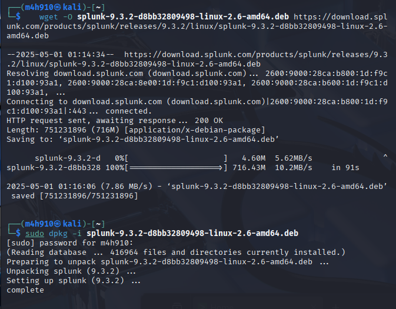
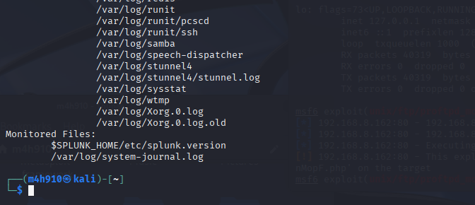
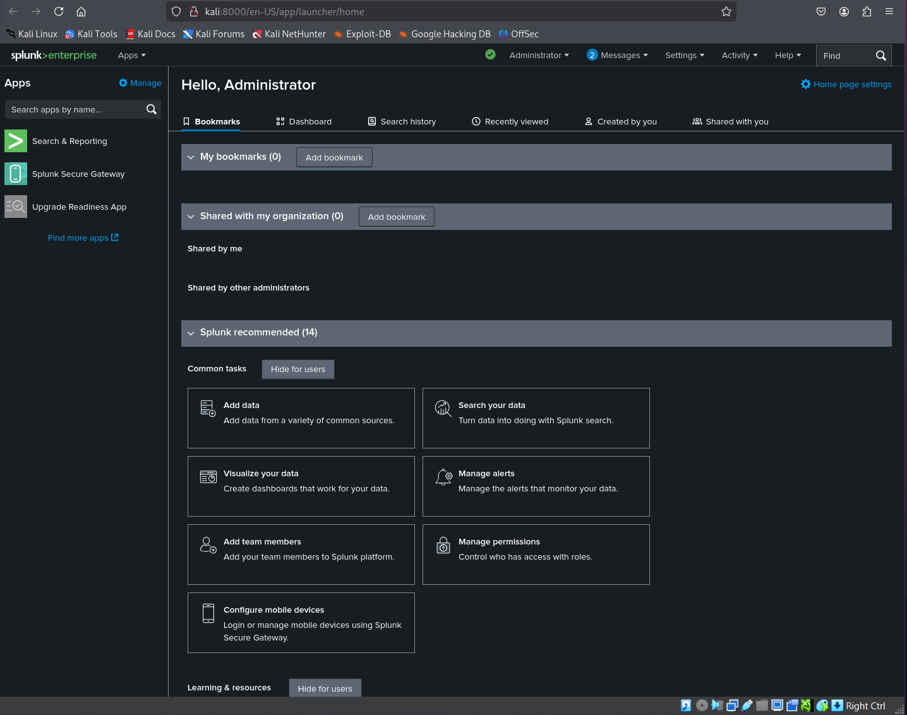
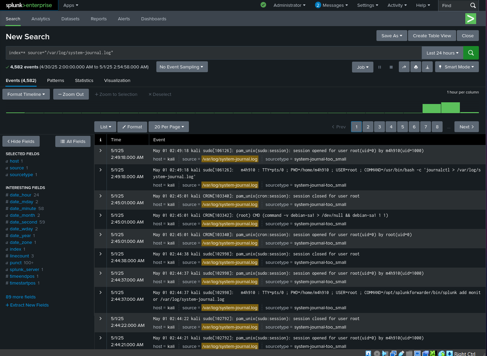
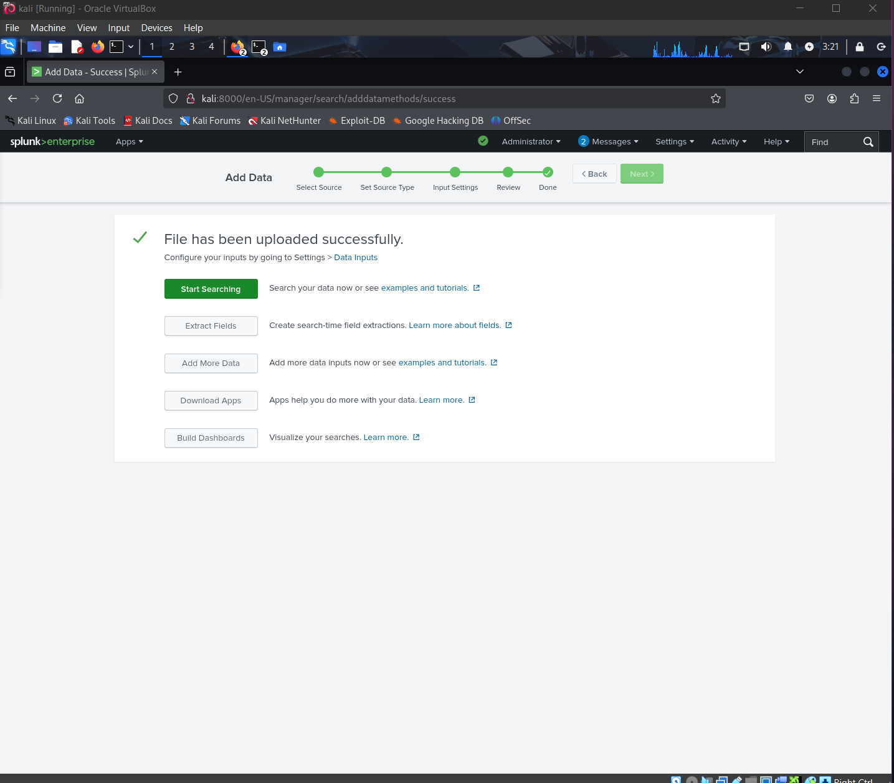
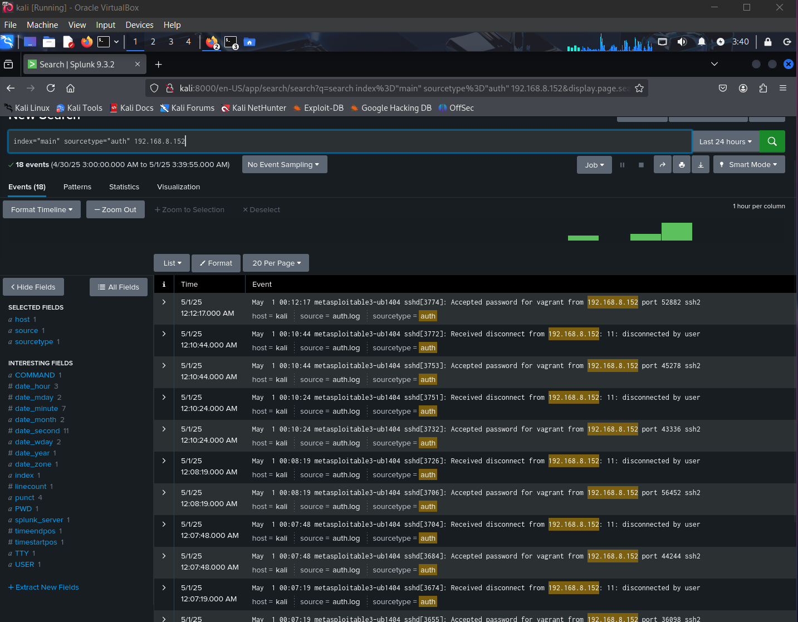

# 📊 Phase 2: SIEM-Based Threat Investigation

## 🛠️ SIEM Configuration Overview

In this phase, we centralized authentication and system log data from both the attacker and victim machines into **Splunk**, our Security Information and Event Management (SIEM) platform of choice. This integration provided a unified view of login activity, attacker movement, and system-level events across environments.

> 📸 *Screenshot A: Importing attacker-side `system-journal.log` into Splunk*  


### 📁 Log Sources Added
- **Victim (Metasploitable3):** Authentication logs (`auth.log`)
- **Attacker (Kali Linux):** System logs (`system-journal.log`)

> 📸 *Screenshot C: Attacker logs (`system-journal.log`) successfully uploaded*  


---

## 🧭 Initial Dashboard Interaction

After successful ingestion, we used Splunk’s **Search & Reporting** app to interact with log data and build exploratory dashboards.

> 📸 *Screenshot B: Landing page of Splunk after login*  


> 📸 *Screenshot D: Querying through the attacker’s journal logs*  


---

## 🔁 Log Transfer Process (Victim to Attacker)

To enable log centralization, we copied the victim's `auth.log` file onto the attacker machine using local file transfer utilities.

> 📸 *Screenshot E: Temporary Python HTTP server set up on victim machine*  


> 📸 *Screenshot F: SSH used to pull logs to attacker system*  


> 📸 *Screenshot H: Importing `auth.log` into Splunk for victim-side analysis*  


---

## 🔬 Analyzing Authentication Patterns

After indexing, we used Splunk’s pattern recognition and custom queries to detect suspicious SSH login behavior.

> 🖼️ *Screenshot: Using Splunk to analyze login behavior over time*  


### 🔍 Key Observations
- 🔐 **Successful SSH logins** from attacker IP `192.168.8.152` using the `vagrant` account.
- 🔄 **Immediate session closures** post-login, suggesting non-interactive or automated access.
- ⚡ **Rapid login bursts** over short time intervals — indicating scripted or tool-based activity.

---

## 🌐 Source IP Analysis

We examined which IPs appeared most frequently in authentication events to confirm attack origin.

> 🖼️ *Screenshot: Most active client IP addresses (via SSH login attempts)*  


### 💡 IP Address Insights
- The attacker machine (Kali, `192.168.8.152`) was the most active.
- No evidence of other external login sources was found.

---

## 📌 Login Event Classification

To understand how the system responded to login attempts, we grouped log events into login status categories.

### 🧾 Query
```spl
index="main" sourcetype="auth" 
| eval status=if(searchmatch("Failed password"), "Failed Login",
          if(searchmatch("Accepted password"), "Successful Login",
          if(searchmatch("invalid user"), "Invalid User", "Other")))
| stats count by status

---
```

## ✅ **Conclusion**

Through centralized log analysis in Splunk, we uncovered clear evidence of a scripted SSH-based attack from IP 192.168.8.152. The pattern of repeated, fast login attempts using valid credentials strongly matched reverse shell behavior observed in Phase 1. This confirmed the compromise and provided structured insight into attacker actions across both systems.
