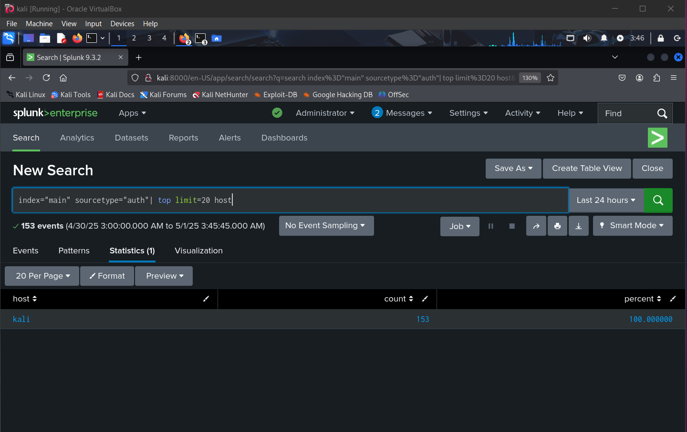

# 🔎 **Phase 2: SIEM-Based Threat Investigation**

## 🛠️ **SIEM Configuration Overview**

For this stage, we centralized log data from both the attacker and victim machines into **Splunk**, our Security Information and Event Management (SIEM) platform of choice. This integration provided a unified environment for identifying threats, examining attacker footprints, and extracting insights from activity logs.

> 📸 *Screenshot A: Importing attacker-side `system-journal.log` into Splunk*  


### 📁 Log Sources Added:
- **Victim (Metasploitable3):** Web server logs (`auth.log`)
- **Attacker (Kali Linux):** System logs (`system-journal.log`)

> 📸 *Screenshot C: Attacker logs (`system-journal.log`) successfully uploaded*


---

## 🧭 **Initial Dashboard Interaction**

After successful ingestion, Splunk’s Search & Reporting module became our main tool for navigating and querying log data.

> 📸 *Screenshot B: Landing page of Splunk after login*


> 📸 *Screenshot D: Querying through the attacker’s journal logs*


---

## 🔁 **Log Transfer Process (Victim to Attacker)**

To make the victim's web access logs available for analysis, we initiated a local file share from Metasploitable3 and retrieved it on the Kali machine.

> 📸 *Screenshot E: Temporary Python HTTP server set up on victim machine*


> 📸 *Screenshot F:(SSH) used to pull logs to attacker system*


> 📸 *Screenshot H: Importing `auth.log` into Splunk for victim-side analysis*


---

## 🔬 **Analyzing Behavioral Patterns in Logs**

Once indexed, we explored Splunk’s built-in pattern recognition features to pinpoint abnormal activity across both environments.

> 🖼 *Screenshot: Using Splunk to spot request patterns*


### Key Observations:
- 🔐 **Successful SSH logins** from `192.168.8.152` using the `vagrant` account.  
- 🔄 **Immediate disconnections** after each login, indicating possible scripted access.  
- ⚡ **Rapid, repeated logins** within seconds — consistent with automated attack behavior.

---

## 🌐 **Client IP Analysis**

We identified which IPs made the most frequent connections, giving us clarity on who interacted with the server and how often.

> 🖼 *Screenshot: Most active client IP addresses*


### IP Address Insights:
- the host kali **192.168.8.152** was the most active, correlating directly with our attacker machine.
---

## 📌 **Key Takeaways from Pattern & IP Analysis**

- Evidence of exploitation centered around specific PHP endpoints.
- The attacker’s IP showed consistent and suspicious activity—likely linked to reverse shell execution and post-exploitation steps.
- The attack timeline matched our expectations from Phase 1, validating the sequence of compromise.

---

## 📉 **HTTP Status Code Breakdown**

To understand server responses to attacker requests, we broke down the HTTP status codes from the access logs.


### 🧾 Query:
```spl
index="main" sourcetype="access_combined" | stats count by status
```

### Insights:
- `200 OK` appeared over 158k times, indicating successful handling of most attacker queries.
- `302 Found` (redirections) could suggest login flows or endpoint reroutes.
- `404 Not Found` signals potential scanning or brute-force attempts targeting non-existent resources.

---

## 📍 **Most Frequently Accessed Endpoints**

We pinpointed which URI paths saw the most traffic, offering a clear view of the attacker’s targets.

```spl
index="main" sourcetype="access_combined" | top limit=10 uri_path
```


### Endpoint Observations:
- `/chat/read_log.php`: Accessed over 155k times — strongly indicative of automation.
- `/chat/post.php`: High interaction likely related to user input or form abuse.
- `/exploit.php`: As the name suggests, this was likely the core of the exploit delivery.
- Other endpoints saw limited hits and were likely part of preliminary scanning.

---

## ✅ **Conclusion**

Through centralized analysis in Splunk, we uncovered significant forensic evidence of a scripted attack from IP `10.0.2.5`, characterized by repeated access to vulnerable endpoints and successful exploitation events. This phase validated the reverse shell deployment observed in Phase 1 and gave us structured, data-driven insight into attacker behavior across both environments.
